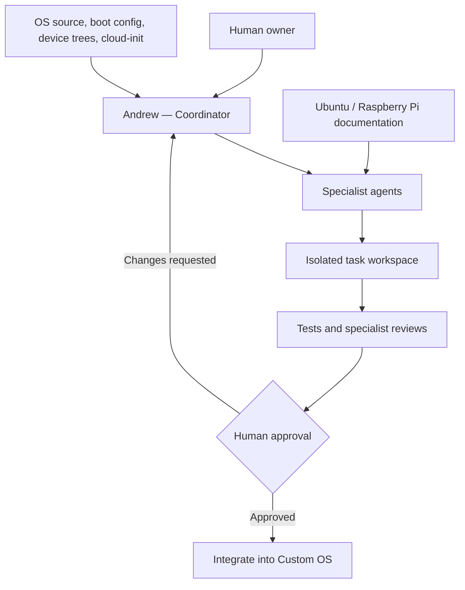

# Custom OS

Custom OS is an Ubuntu 26.04-based operating system built for Raspberry Pi,
developed and maintained by a coordinated team of AI engineering agents powered
by [elizaOS](https://github.com/elizaos/eliza).

> [!IMPORTANT]
> Custom OS is at an early stage. The agent-assisted development workflow
> described below is being actively built out. The OS boot partition is
> functional on supported Raspberry Pi hardware; the AI engineering organization
> is operational in the [OnlyMen](https://github.com/18nover/onlymen) project
> and is being extended to cover Custom OS development.

## What It Is

Custom OS is two things working together:

1. **A custom Ubuntu-based operating system** — a tailored boot image for
   Raspberry Pi hardware (Pi 3, Pi 4, Pi 5 families) with cloud-init
   provisioning, A/B tryboot for safe updates, and broad peripheral support
   through 367+ device tree overlays.

2. **An AI engineering organization** — a team of 13 specialized agents built
   on elizaOS that collaborate on planning, implementing, testing, reviewing,
   and documenting the OS. The same agents already serve the
   [OnlyMen](https://github.com/18nover/onlymen) project and are being
   extended to work across both codebases.

## Supported Hardware

| Platform | Models | SoC |
| --- | --- | --- |
| Raspberry Pi 3 | Pi 3B, 3B+, Zero 2, Zero 2W, CM3, CM0 | BCM2710 |
| Raspberry Pi 4 | Pi 4B, Pi 400, CM4, CM4S, CM4-IO | BCM2711 |
| Raspberry Pi 5 | Pi 5B, Pi 500, CM5 (multiple variants) | BCM2712 |

All models boot in 64-bit (arm64) mode. The boot firmware, device trees, and
kernel are included in the repository under `current/`.

## Boot Architecture

```
custom-os/
├── bootcode.bin              # First-stage bootloader (Pi 3)
├── start*.elf / fixup*.dat   # GPU firmware for all Pi variants
├── config.txt                # Boot configuration (arm64, KMS, overlays)
├── autoboot.txt              # A/B tryboot for safe firmware updates
├── user-data                 # cloud-init provisioning
├── meta-data                 # cloud-init metadata
└── current/                  # Active boot partition
    ├── vmlinuz               # Linux kernel (arm64)
    ├── initrd.img            # Initial ramdisk
    ├── cmdline.txt           # Kernel command line
    ├── state                 # Tryboot state ("good" / "new")
    ├── bcm27*.dtb            # Device trees (Pi 3, 4, 5)
    └── overlays/             # 367+ device tree overlays
        ├── *.dtbo            # Audio, display, camera, sensor, bus overlays
        └── README            # Raspberry Pi overlay documentation
```

### Key Features

- **A/B tryboot** — `autoboot.txt` enables safe partition switching so a bad
  update can be rolled back automatically.
- **cloud-init provisioning** — `user-data` and `meta-data` configure users,
  networking, packages, and swap on first boot without manual intervention.
- **KMS graphics** — full kernel modesetting via `vc4-kms-v3d` overlay, with
  camera and display auto-detection on CSI/DSI ports.
- **Peripheral support** — 367 device tree overlays covering audio DACs/amps
  (HiFiBerry, JustBoom), camera modules (IMX series), SPI/I2C/UART
  configurations, CAN bus, GPIO functions, and more.

## The AI Engineering Organization

Custom OS development is supported by the same 13 elizaOS agents that power
the [OnlyMen](https://github.com/18nover/onlymen) engineering organization.
Each agent is a specialized AI assistant grounded in project-specific knowledge
through retrieval — not fine-tuning — and they collaborate using a structured
coordination protocol.

### The Team

| Agent | Role | Responsibility |
| --- | --- | --- |
| **Andrew** | Engineering Director | Plans sprints, assigns work, resolves blockers, coordinates across all domains. Never writes implementation code — delegates to specialists. |
| **Audrey** | Repository Auditor | Dependency audits, dead code detection, technical debt tracking, fork drift analysis. Reports findings with file paths and line numbers. |
| **Desiree** | Design System Architect | Visual consistency, color tokens, typography, spacing, responsive layouts, dark mode, and WCAG compliance. |
| **Devon** | DevOps Engineer | Docker, CI/CD (GitHub Actions), build automation, monitoring, logging, secret rotation, backups. "If it can be automated, it should be." |
| **Ethan** | Accessibility Engineer | WCAG 2.1 AA compliance, screen reader testing, keyboard/focus management. "An inaccessible feature is a broken feature." |
| **Karen** | Moderation Specialist | Moderation tooling, label taxonomy, report triage, appeals, and content safety policy. |
| **Lexi** | Schema Design Specialist | Schema contracts, naming conventions, codegen pipeline, backward compatibility. "A schema is a contract." |
| **Morgan** | Backend Architect | APIs, database schemas, authentication flows, caching strategies, server architecture. |
| **Nadia** | Frontend Architect | Client architecture, application state, navigation, platform-specific code, and performance. |
| **Parker** | Performance Engineer | Profiling memory, battery, network, rendering, and startup. Maintains performance budgets. |
| **Penelope** | Technical Writer | READMEs, API docs, architecture docs, runbooks, release notes, and post-mortems. "If it's not documented, it doesn't exist." |
| **Quinn** | QA Engineer | Test plans, edge cases, cross-platform testing, offline scenarios, and release readiness. |
| **Seth** | Security Engineer | Threat modeling, secret handling, authentication review, privacy, and secure defaults. Final security gate before production. |

### How Agents Work on Custom OS



The coordinator routes work to the appropriate specialist, maintains task and
review state, surfaces disagreements, and returns clear decisions to the human
owner. All coding happens in isolated branches so proposed changes can be
tested and reviewed before reaching `main`.

### Custom OS-Specific Agent Roles

While the agents were originally built for application development, several
specializations map directly to OS work:

- **Devon** (DevOps) — boot configuration, cloud-init provisioning, A/B
  update workflows, image builds, and CI/CD for OS releases.
- **Morgan** (Backend) — kernel configuration, system services, storage,
  networking, and server-side infrastructure.
- **Seth** (Security) — secure boot, firmware integrity, secret management,
  hardening, and privacy review.
- **Parker** (Performance) — boot time profiling, memory footprint, I/O
  tuning, and resource budgets on constrained Pi hardware.
- **Audrey** (Auditor) — tracking upstream Ubuntu/Raspberry Pi firmware
  changes, device tree drift, and dependency freshness.
- **Quinn** (QA) — hardware compatibility testing across Pi families, overlay
  verification, and upgrade path validation.
- **Penelope** (Docs) — boot documentation, cloud-init guides, hardware
  compatibility matrices, and release notes.

## Relationship to OnlyMen

[OnlyMen](https://github.com/18nover/onlymen) is a decentralized social media
platform built on the AT Protocol (a Bluesky fork). It was the first project
to use this AI engineering organization, and its `eliza/` directory contains
the canonical agent definitions, knowledge bases, coordination plugin, and
shared engineering standards.

Custom OS is the second project to use the same agent team. The agents share a
common coordination protocol and engineering standards, but each project
provides its own grounding knowledge — OS boot configuration and hardware
docs for Custom OS, AT Protocol and React Native docs for OnlyMen.

This multi-project architecture means improvements to agent capabilities,
coordination workflows, or shared engineering standards benefit both projects
automatically.

## Planned Administration Interface

The following commands are proposed for managing the agent-assisted development
workflow. **These commands are not implemented yet.**

| Command | Purpose |
| --- | --- |
| `custom-os doctor` | Check the development environment, dependencies, and project configuration. |
| `custom-os start` | Start the coordinator and configured agents. |
| `custom-os ask` | Send a goal or question to the coordinator. |
| `custom-os scan` | Refresh project knowledge from boot config, device trees, and cloud-init. |
| `custom-os plan` | Produce a scoped, reviewable implementation plan. |
| `custom-os code` | Begin an approved task in an isolated workspace. |
| `custom-os review` | Request or inspect specialist review results. |
| `custom-os status` | Show active tasks, reviews, blockers, and agent health. |
| `custom-os stop` | Stop running agents and related services. |

## Guardrails

- Every task has a defined scope, owner, expected artifacts, and completion
  criteria.
- Agents work in isolated branches or worktrees.
- Tests and applicable specialist reviews run before integration is proposed.
- Recommendations cite repository evidence or approved sources.
- Failures and uncertainty are surfaced, not hidden.
- Secrets are never committed or printed in logs and prompts.
- Agents cannot bypass an unresolved security or quality blocker.
- Commits, merges, pushes, releases, deployments, and destructive operations
  require explicit human authorization.

## Roadmap

- [ ] **Foundation** — establish the repository structure, boot partition
  layout, and cloud-init configuration for supported Pi hardware.
- [ ] **Agent grounding** — create Custom OS-specific knowledge files for
  Devon, Morgan, Seth, Parker, Audrey, Quinn, and Penelope covering boot
  config, device trees, cloud-init, and Ubuntu packaging.
- [ ] **Grounded coordinator** — connect Andrew to Custom OS project
  knowledge and persistent task state.
- [ ] **Core engineering team** — activate the first specialists for OS
  development: DevOps, backend, security, QA, and documentation.
- [ ] **Image build pipeline** — automated OS image builds with A/B update
  support and hardware compatibility testing.
- [ ] **Gated workflow** — isolated workspaces, automated tests, specialist
  reviews, and human approval before integration.
- [ ] **Complete organization** — all 13 agents active with OS-specific
  knowledge and clear ownership.
- [ ] **Multi-project sync** — shared agent improvements flow between Custom
  OS and OnlyMen automatically.

## Getting Started

Reproducible installation and usage instructions will be added after the agent
grounding and build pipeline are established. For now, the boot partition files
can be written to a microSD card for supported Raspberry Pi hardware.

For background on the agent framework, see:

- [elizaOS source repository](https://github.com/elizaos/eliza)
- [elizaOS agent customization guide](https://docs.elizaos.ai/guides/customize-an-agent)
- [OnlyMen engineering organization](https://github.com/18nover/onlymen/tree/main/eliza)

## Contributing

The project is not ready for general contributions yet. Contribution guidance,
development setup, and review requirements will be published after the agent
grounding and build pipeline are in place.

## License

A license has not been selected for Custom OS. Until a license is added, no
permission is granted to copy, modify, or redistribute this project's original
work. Third-party components (Ubuntu firmware, Raspberry Pi boot files, device
tree overlays) remain subject to their own licenses.
