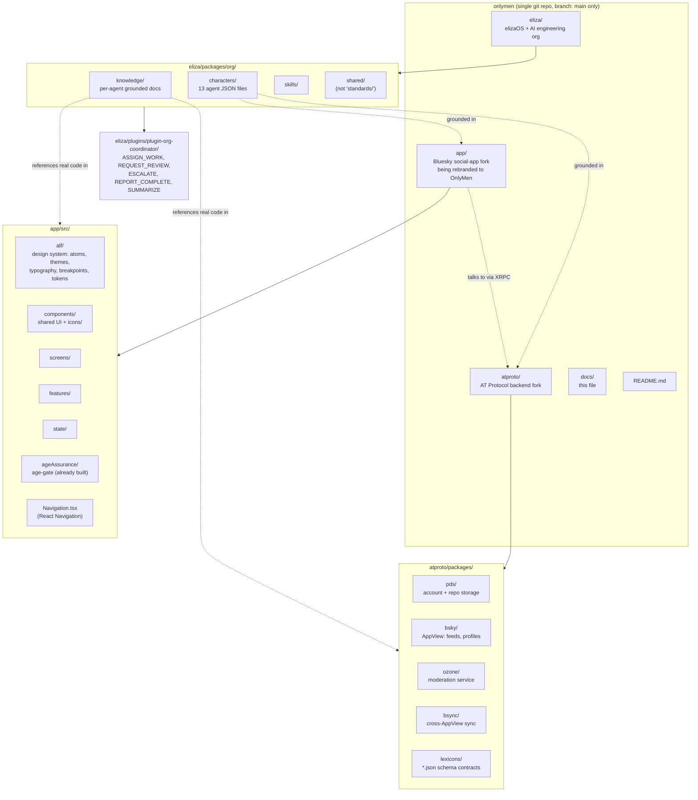

# OnlyMen — project handoff

Living reference for anyone (human or AI) picking up work on this repo cold.
Verify anything time-sensitive below against the actual repo state before
acting on it — this is a snapshot, not a live source of truth.

## What this project is

**OnlyMen** — a decentralized social media app for gay men 18+, built on
[AT Protocol](https://atproto.com) (the same open/federated protocol that
powers Bluesky). Launching web + Android first, iOS later. Do not describe
this as a camera/object-detection/livestreaming app — that was a leftover,
unrelated product vision baked into the AI org's characters early on and has
been deliberately removed.

## Repo structure



## Project conventions (as of this handoff)

- **Single `main` branch only** — no `dev`, no long-lived feature branches.
  Push directly to `main`. Since there's no PR gate, run `bun run verify`
  (eliza) / `pnpm verify` (atproto) yourself before pushing anything
  nontrivial. Use `git tag` for release/rollback checkpoints instead of
  branches (e.g. `v0.1.0-web-launch`).
- **Naming**: prefer one clear word for files/directories
  (`labels.md`, `ozone.md`); when a second word is genuinely needed, one
  hyphen, two words max (`lexicon-schema.md`) — don't stack three+ words or
  mix underscores and hyphens in the same name.
- **Formatting**: 2-space indent, LF line endings, trim trailing whitespace
  (except Markdown, where trailing spaces can be meaningful) — enforced by
  the root `.editorconfig`, consistent with all three sub-projects' own
  Prettier/Biome configs (all already 2-space, no semicolons, single quotes).
- **Colors/brand palette**: not yet decided — `app/src/alf/themes.ts` /
  `tokens.ts` still pull Bluesky's actual blue palette. Ask the user before
  touching this; they've explicitly deferred it, not delegated it.

## Repo state

- One git repo, root `/home/jerry/onlymen`, remote `origin` =
  `https://github.com/18nover/onlymen.git`, branch `main`.
- `app/`, `atproto/`, `eliza/` are plain tracked subdirectories in this one
  repo — not separate nested repos with their own history/remotes (that
  changed early in this repo's history: `eliza cloned into onlymen`,
  `atproto cloned into onlymen`, `bsky cloned as app`).
- `node_modules` is absent in all three sub-projects in this environment —
  install before running/building anything (`bun install` for eliza,
  `pnpm install` for app/atproto).
- `github.com/18nover/onlygay` is a different, unrelated repo the user
  created themselves — don't confuse it with this one.

## Major completed work

Core task: align the 13-agent "OnlyMen AI Engineering Organization"
(`eliza/packages/org/`) to actually help build the real Bluesky app + AT
Protocol backend, replacing an old, unrelated camera/object-detection/
livestreaming product vision the org was originally (wrongly) built around.

| Agent | `ORG_ROLE` | Knowledge files |
|---|---|---|
| Atlas | `engineering_director` | `project-management.md`, `onlymen-roadmap.md`, + shared: `engineering-handbook.md`, `communication-protocol.md`, `definition-of-done.md` |
| Circuit | `devops_engineer` | `docker-compose.md`, `github-actions.md`, `eas-builds.md`, `monitoring.md`, `backup-restore.md` |
| Compass | `qa_engineer` | `test-plan-template.md`, `edge-case-catalog.md`, `accessibility-testing.md`, `interop.md`, `mock-pds.md`, + shared `testing-standards.md` |
| Echo | `repository_auditor` | `audit-checklist.md`, `dependency-analysis.md`, `technical-debt-patterns.md`, + shared `coding-standards.md`, `security-standards.md` |
| Forge | `backend_architect` | `auth-patterns.md`, `api-design.md`, `postgresql-guide.md`, `docker-guide.md`, `redis-patterns.md`, + shared `security-standards.md`, `architecture-principles.md` |
| Lexi (was Stream) | `lexicon_specialist` | `lexicon-schema.md`, `nsid.md`, `codegen.md`, `validation.md` |
| Nova | `react_native_architect` | `react-native-patterns.md`, `expo-sdk-guide.md`, `navigation-patterns.md`, `state-management.md`, + shared `coding-standards.md`, `design-principles.md` |
| Pixel | `design_system_architect` | `alf-design-system.md`, `color-system.md`, `typography.md`, `spacing.md`, `responsive-layouts.md`, + shared `design-principles.md` |
| Prism | `accessibility_engineer` | `wcag-mobile-mapping.md`, `screen-reader-testing.md`, `react-native-a11y.md`, + shared `design-principles.md`, `review-process.md` |
| Pulse | `performance_engineer` | `memory-profiling.md`, `battery-optimization.md`, `network-optimization.md`, `bundle-analysis.md` |
| Scribe | `technical_writer` | `documentation-templates.md`, `api-doc-standards.md`, `runbook-template.md`, `release-notes-template.md`, + shared `documentation-standards.md` |
| Sentinel | `security_engineer` | `owasp-mobile.md`, `threat-modeling.md`, `secret-management.md`, `encryption-guide.md`, + shared `security-standards.md` |
| Vision (was computer-vision) | `moderation_specialist` | `moderation-actions.md`, `labels.md`, `triage.md`, `ozone.md` |

Also: deleted two off-stack skill files (`skills/computer-vision`,
`skills/stream-integration`), replaced with `skills/moderation-tooling`
(Vision) and `skills/lexicon-design` (Lexi); fixed
`eliza/plugins/plugin-org-coordinator/src/actions/index.ts`'s `ORG_AGENTS`
list (was still listing `'stream'`, now `'lexi'`); regenerated
`eliza/packages/org/docs/agents/*.md` via `bun run docs` (auto-generated —
never hand-edit, re-run the script instead); rewrote the root `README.md` to
describe the real product and the real purpose of the AI org; fixed a
broken knowledge reference (`atlas.json` pointed at `onlymen-roadmap.md`
before the file itself had been renamed to match — renamed the file, not
the reference, since the reference already reflected forward intent).

## Important gotcha for whoever picks this up next

Mid-project, the repo was restructured (separate nested git repos collapsed
into one) from what turned out to be an older snapshot than the most recent
fixes at the time. This silently reverted several already-committed fixes
back to their pre-fix state, even though `git log` showed them as committed
on a since-defunct branch. It took direct content verification (grep/read
actual files, not trusting git log) to catch this.

**Lesson: after any repo restructuring, branch surgery, or unexplained gap,
verify actual file content on disk — don't assume "it was committed once"
means it's still there.** Sanity check:

```bash
cd eliza/packages/org
grep -rliE "camera|object.detection|yolo|tflite|nottyboi.vision.api" characters/ knowledge/ skills/ shared/ docs/ 2>/dev/null
# should return nothing (or only legitimate expo-camera/photo-upload references — verify by reading)
for f in characters/*.json; do node -e "JSON.parse(require('fs').readFileSync('$f','utf8'))" || echo "BROKEN: $f"; done
node -e '
const fs=require("fs"),path=require("path");
for (const f of fs.readdirSync("characters")) {
  if (!f.endsWith(".json")) continue;
  const c = JSON.parse(fs.readFileSync(path.join("characters",f),"utf8"));
  for (const k of c.knowledge||[]) if (!fs.existsSync(path.join("characters",k.path))) console.log("BROKEN REF:",f,k.path);
}'
```

## Known not-yet-done / lower priority

- **Repo-wide "NottyBoi" → "OnlyMen" branding sweep never done** — 34 files
  still contained "nottyboi" (case-insensitive) as of the last check across
  `characters/`, `knowledge/`, `skills/`, `shared/`. Only off-stack *content*
  issues (camera/vision/Stream.io) were fixed, not branding strings. If you
  do this sweep: rename actual files *and* every reference to them in the
  same pass (the broken-reference bug above happened from doing only half
  of that), then re-run the checker script above.
- `@bsky.app/alf`'s actual token *values* (hex colors, spacing px scale)
  were never directly verified — the package isn't installed anywhere in
  this environment, so only the re-export/extension pattern in
  `app/src/alf/` was confirmed, not the underlying values.
- A Figma MCP design-system-rules command was run once against `app/`.
  Findings: styling is ALF (atoms/theme/breakpoints, not styled-components/
  Tailwind), icons live in `src/components/icons/*.tsx` with a
  `{Name}_Stroke{width}_Corner{radius}_Rounded` naming convention built via
  `createSinglePathSVG`/`createMultiPathSVG` factories in `TEMPLATE.tsx`,
  navigation is React Navigation (not Expo Router), no Storybook exists.
  Redo the analysis fresh if a Figma integration task comes up again rather
  than assuming this is still current.
- **"Expo Go" is not how Android/iOS will ship** — the app uses the Expo
  *framework*, but has custom native modules/config that Expo Go (the
  generic sandbox app) can't run. Real distribution is `eas build` → native
  APK/IPA → Play Store / App Store, same as any native app. Shipping web
  first is still a reasonable sequence (it's genuinely the lowest-effort
  target — `app/`'s web build is a Go binary + static export, Docker-ready)
  — just not because Expo Go makes native "free."
- Things flagged for the user's own follow-up (not yet acted on by anyone):
  App Store/Play Store 18+ UGC policy compliance (moderation, block/report,
  EULA — required for approval, not optional), trademark/name-collision
  check for "OnlyMen", extending `eliza/.gitleaks.toml`-style secret
  scanning repo-wide (currently only covers `eliza/`), license reconciliation
  (both forks are MIT — keep their notices, decide OnlyMen's own license for
  original code), no CI currently runs against the unified repo itself.

## Raspberry Pi migration — historical assessment (STALE, re-verify)

Separate thread: user's WSL kept crashing, considered migrating off WSL onto
a home Raspberry Pi (`admin@192.168.1.91`, hostname `lockard-tech`). Assessed,
never executed. **Describes the OLD separate-nested-repos structure — no
longer accurate, re-verify before acting.**

- Pi hardware (at the time): aarch64, 4 cores, ~4GB RAM, 2GB swap, 114GB disk
  (77GB free).
- SSH key lives on the **Windows side** of WSL, not `~/.ssh/`:
  `/mnt/c/Users/jerry/.ssh/ssh_lockard` (+ `.pub`).
- Feasibility (re-verify against the now-unified repo): `atproto/`'s 4
  services are Docker-ready/ARM64-viable now; `app/`'s **web** target is
  Pi-viable but its Dockerfile hardcoded `GOARCH=amd64` (needs `arm64`);
  iOS/Android builds should stay off the Pi regardless. `eliza/`'s full
  bun+Node24+embedded-Postgres stack was flagged as untested/risky on 4GB
  RAM. Recommended: migrate `atproto/` first as a low-risk trial.
- Never rsync `node_modules` (x86 binaries, won't run on ARM64) or live
  embedded-Postgres data without stopping the DB first.

## GitHub push authentication (this environment)

No GitHub credentials exist by default in this WSL environment. What worked:
user generated an SSH key, added it to GitHub, and an SSH agent socket
appeared at `~/.ssh/agent/s.<random>.agent.<random>` — exporting
`SSH_AUTH_SOCK` to that path before `git push` (remote set to the
`git@github.com:...` SSH form, not HTTPS) let pushes succeed. That socket
path is ephemeral — if a push fails with "Permission denied (publickey)",
check `ls ~/.ssh/agent/` for a current socket, or have the user push
manually from their own terminal.
