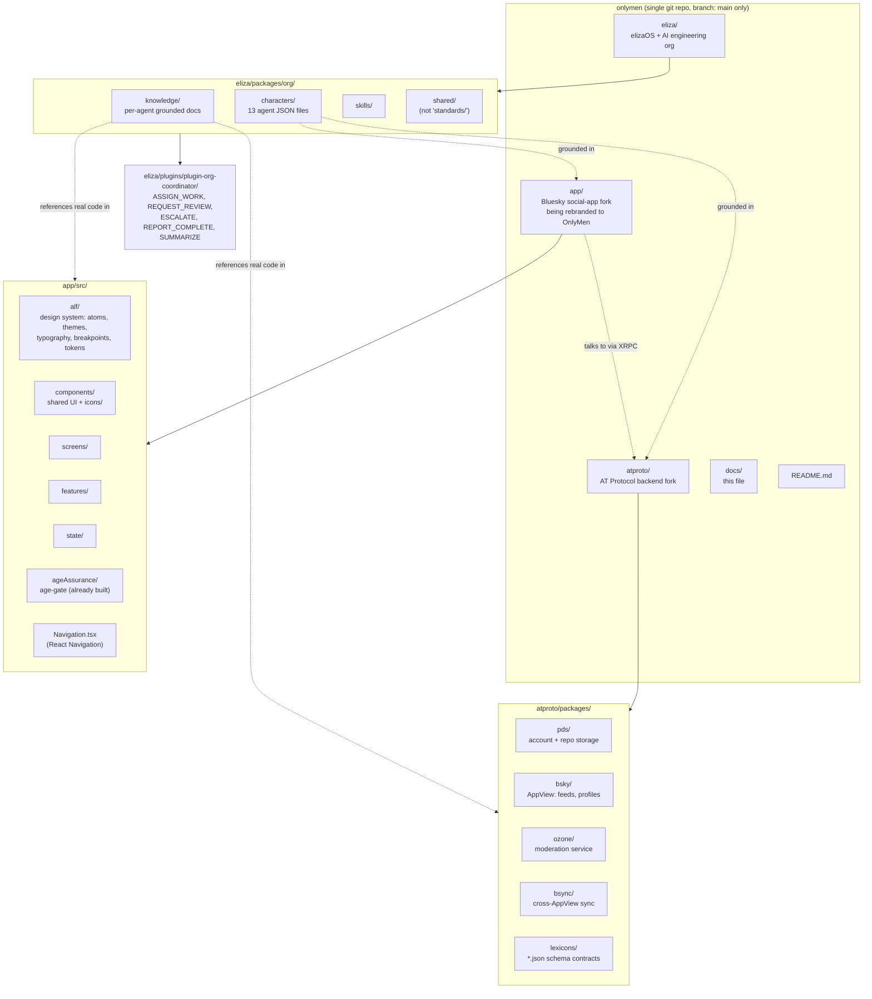

# OnlyMen — Project Handoff

Living reference for anyone (human or AI) picking up work on this repo cold.
Verify anything time-sensitive below against the actual repo state before
acting on it — this is a snapshot, not a live source of truth. Dated history
of completed work lives in `docs/CHANGELOG.md`. When you finish something,
add it to CHANGELOG.md and update only the still-current facts here.

**Brand / domains:**
- GitHub org/user: **18nover**
- Repo: **onlymen** (`github.com/18nover/onlymen`)
- Live domains: **onlymen.gay** and **18nover.gay**

---

## Recap of Most Recent Session (2026-07-22, agent rename + Custom OS)

- Renamed all 13 agent character files from code-style names (Atlas, Circuit,
  etc.) to the human-name roster in `AGENTS.md` (Andrew, Devon, etc.) —
  files, folders, cross-references, `ORG_AGENTS`, and generated docs all
  updated and regenerated. See `CHANGELOG.md` for the full file list.
- Added Custom OS grounding for Devon, Morgan, Seth, Parker, Audrey, Quinn,
  and Penelope (new `shared/custom-os.md` primer + one knowledge file each) —
  the other 6 agents remain OnlyMen/Bluesky-only.
- Discovered `custom-os/` is checked into this tree as a **nested git
  repository** (own `.git`, own GitHub remote `jerry-lockard/custom-os`),
  not a submodule — see the "Repo state" note below and Audrey's
  `custom-os-audit.md`. **Correction (later same session): this was wrong.**
  Re-investigated — no `.git` exists under `custom-os/`; it's a plain
  tracked subdirectory, added whole in commit `053149171`. All docs/
  knowledge files written on the false premise were corrected — see the
  "Custom OS repo-reconciliation" entry in `CHANGELOG.md`.

---

## Recap of Most Recent Session (2026-07-19, docs pass)

- **FIREWALL.md**: Created — SSH rate-limit, Docker/UFW bypass warning, IPv6
  rules, spec-based deletes, RDP removed from core services.
- **CHANGELOG.md**: Created with full session history.
- **AGENTS.md**: Created with 13 human names for the engineering org (see
  roster below). Applied to the codebase on 2026-07-22 — see the rename
  entry in `CHANGELOG.md`. `characters/*.json`, `ORG_AGENTS`, knowledge
  folders, docs, and skills all now use the human-name roster.
- **HANDOFF.md**: This section added; domain branding added.
- **Makefile**: Created at project root (`make handoff`, `make changelog`,
  `make log`, `make update`, `make help`).

Also noted: the `claude/bluesky-agents-planning-mpzmvd` branch has been
merged to main via PR #1. It contained the full NottyBoi branding sweep,
agent retraining, and plugin rename. The remote branch should be deleted
to comply with the single-`main` convention.

---

## What this project is

**OnlyMen** — a decentralized social media app for gay men 18+, built on
[AT Protocol](https://atproto.com) (the same open/federated protocol that
powers Bluesky). Launching web + Android first, iOS later. Do not describe
this as a camera/object-detection/livestreaming app — that was a leftover,
unrelated product vision baked into the AI org's characters early on and has
been deliberately removed.

## Repo structure



## Project conventions (as of this handoff)

- **Single `main` branch only** — no `dev`, no long-lived feature branches.
  Push directly to `main`. Since there's no PR gate, run `bun run verify`
  (eliza) / `pnpm verify` (atproto) yourself before pushing anything
  nontrivial. Use `git tag` for release/rollback checkpoints instead of
  branches (e.g. `v0.1.0-web-launch`).
- **Naming (confirmed by the user)**: prefer one clear word for files/
  directories (`labels.md`, `ozone.md`); when a second word is genuinely
  needed, **one hyphen**, two words max (`lexicon-schema.md`) — don't stack
  three+ words or mix underscores and hyphens in the same name. Same hyphen
  style for release tags (`v0.1.0-web-launch`).
- **Formatting**: 2-space indent, LF line endings, trim trailing whitespace
  (except Markdown, where trailing spaces can be meaningful) — enforced by
  the root `.editorconfig`, consistent with all three sub-projects' own
  Prettier/Biome configs (all already 2-space, no semicolons, single quotes).
- **Colors/brand palette**: deliberately deferred until real UI work starts
  — `app/src/alf/themes.ts` / `tokens.ts` still pull Bluesky's actual blue
  palette, untouched on purpose. The user's stated direction for later:
  something like OnlyFans' light palette, or a Facebook-blue-style palette —
  not decided, just a starting direction to react to when the time comes.
  Don't touch colors without asking first; this has been explicitly
  deferred, not delegated.

## Repo state

- One git repo, root `/home/jerry/onlymen`, remote `origin` =
  `https://github.com/18nover/onlymen.git`, branch `main`.
- `app/`, `atproto/`, `eliza/`, and `custom-os/` are all plain tracked
  subdirectories in this one repo — not separate nested repos with their
  own history/remotes (that changed early in this repo's history: `eliza
  cloned into onlymen`, `atproto cloned into onlymen`, `bsky cloned as
  app`; `custom-os/` was added whole later, in commit `053149171` "custom
  os was added", 2026-07-22).
- **Correction**: an earlier pass through this repo (same day) concluded
  `custom-os/` was a separate nested git repo with its own `.git` and
  remote, and wrote several docs/knowledge files on that basis. That was
  re-investigated and found false — no `.git` exists under `custom-os/`,
  it's tracked as plain blobs same as everything else. All references to a
  separate repo have been corrected; see `docs/CHANGELOG.md`.
- `node_modules` is absent in all three sub-projects in this environment —
  install before running/building anything (`bun install` for eliza,
  `pnpm install` for app/atproto).
- `github.com/18nover/onlygay` is a different, unrelated repo the user
  created themselves — don't confuse it with this one.

## Major completed work

Core task: align the 13-agent "OnlyMen AI Engineering Organization"
(`eliza/packages/org/`) to actually help build the real Bluesky app + AT
Protocol backend, replacing an old, unrelated camera/object-detection/
livestreaming product vision the org was originally (wrongly) built around.

| Agent | `ORG_ROLE` | Knowledge files (bold = added in the Bluesky retraining) |

**Update (2026-07-22): renamed.** All 13 agents now use the human-name
roster (Andrew, Devon, Quinn, Audrey, Morgan, Lexi, Nadia, Desiree, Ethan,
Parker, Penelope, Seth, Karen) documented in `docs/AGENTS.md`, applied
across character files, `ORG_AGENTS`, knowledge paths, docs, and skills.
The table below is kept for historical mapping context (old code-style name
→ current role); read the "Agent (current)" column as **stale** — see
`docs/AGENTS.md` for the current names.

| Agent (current) | `ORG_ROLE` | Knowledge files (bold = added in the Bluesky retraining) |
|---|---|---|
| Atlas | `engineering_director` | `project-management.md`, `onlymen-roadmap.md` (rewritten — real ATProto roadmap), + shared: `engineering-handbook.md`, `communication-protocol.md`, `definition-of-done.md` |
| Circuit | `devops_engineer` | **`services.md`**, `docker-compose.md`, `github-actions.md`, `eas-builds.md`, `monitoring.md`, `backup-restore.md` |
| Compass | `qa_engineer` | `test-plan-template.md`, `edge-case-catalog.md` (+ ATProto edge-case table), `accessibility-testing.md`, `interop.md`, `mock-pds.md`, + shared `testing-standards.md` |
| Echo | `repository_auditor` | **`forks.md`**, `audit-checklist.md`, `dependency-analysis.md`, `technical-debt-patterns.md`, + shared `coding-standards.md`, `security-standards.md` |
| Forge | `backend_architect` | **`pds.md`**, **`appview.md`**, **`xrpc.md`**, **`firehose.md`**, `auth-patterns.md`, `api-design.md` (XRPC-first), `postgresql-guide.md`, `docker-guide.md`, `redis-patterns.md`, + shared `security-standards.md`, `architecture-principles.md` |
| Lexi (was Stream) | `lexicon_specialist` | **`contact-ageassurance.md`**, `lexicon-schema.md` (+ full type inventory), `nsid.md`, `codegen.md`, `validation.md` |
| Nova | `react_native_architect` | **`client.md`**, `react-native-patterns.md`, `expo-sdk-guide.md`, `navigation-patterns.md`, `state-management.md`, + shared `coding-standards.md`, `design-principles.md` |
| Pixel | `design_system_architect` | `alf-design-system.md` (rewritten from real `app/src/alf/` source), **`icons.md`**, `color-system.md`, `typography.md`, `spacing.md`, `responsive-layouts.md`, + shared `design-principles.md` |
| Prism | `accessibility_engineer` | `wcag-mobile-mapping.md`, `screen-reader-testing.md`, `react-native-a11y.md`, + shared `design-principles.md`, `review-process.md` |
| Pulse | `performance_engineer` | `memory-profiling.md`, `battery-optimization.md`, `network-optimization.md` (+ real network profile), `bundle-analysis.md` |
| Scribe | `technical_writer` | `documentation-templates.md`, `api-doc-standards.md` (lexicons-first), `runbook-template.md`, `release-notes-template.md`, + shared `documentation-standards.md` |
| Sentinel | `security_engineer` | **`identity.md`**, **`oauth.md`**, `owasp-mobile.md`, `threat-modeling.md` (+ OnlyMen outing-risk model), `secret-management.md`, `encryption-guide.md`, + shared `security-standards.md` |
| Vision (was computer-vision) | `moderation_specialist` | **`reporting.md`**, `moderation-actions.md`, `labels.md`, `triage.md`, `ozone.md` |

All 13 agents also reference the new shared primer **`shared/atproto.md`**
and carry an identical `## Project` section at the top of their `system`
prompt anchoring them to OnlyMen-on-ATProto (dev-helpers only — no live
Bluesky network access; plugin-bluesky deliberately not wired).

### Bluesky retraining (second major pass)

Knowledge was rebuilt from three sources: (1) the actual forks — every new
doc cites real paths in `atproto/packages/*` and `app/src/*` verified on
disk; (2) official ATProto/Bluesky concepts (lexicon type system, DID/
handle rules, OAuth profile, labels) distilled into the docs; (3) the
existing 66 docs deepened in place. **Key factual correction:**
`app.bsky.contact.*` and `app.bsky.ageassurance.*` are **upstream Bluesky
lexicon families** (fully present in the generated `@atproto/api` client
and the app UI), not OnlyMen customizations — earlier claims that these
were "our custom lexicons" (and an `app.nottyboi.*` namespace note in
`shared/architecture-principles.md`) were wrong and have been fixed.
OnlyMen currently ships **no** custom lexicons. Also killed: Pixel's
invented `@alf/core` API docs (real ALF = npm `@bsky.app/alf` extended by
`app/src/alf/`, imported as `#/alf`), Atlas's stale chat/Twitch/YouTube
roadmap (rewritten to the real web+Android ATProto plan), and fake 768px
breakpoints (real: 500/800/1300 via `useBreakpoints()`).

Also: deleted two off-stack skill files (`skills/computer-vision`,
`skills/stream-integration`), replaced with `skills/moderation-tooling`
(Vision) and `skills/lexicon-design` (Lexi); fixed
`eliza/plugins/plugin-org-coordinator/src/actions/index.ts`'s `ORG_AGENTS`
list (was still listing `'stream'`, now `'lexi'`); regenerated
`eliza/packages/org/docs/agents/*.md` via `bun run docs` (auto-generated —
never hand-edit, re-run the script instead); rewrote the root `README.md` to
describe the real product and the real purpose of the AI org; fixed a
broken knowledge reference (`atlas.json` pointed at `onlymen-roadmap.md`
before the file itself had been renamed to match — renamed the file, not
the reference, since the reference already reflected forward intent).

## Important gotcha for whoever picks this up next

Mid-project, the repo was restructured (separate nested git repos collapsed
into one) from what turned out to be an older snapshot than the most recent
fixes at the time. This silently reverted several already-committed fixes
back to their pre-fix state, even though `git log` showed them as committed
on a since-defunct branch. It took direct content verification (grep/read
actual files, not trusting git log) to catch this.

**Lesson: after any repo restructuring, branch surgery, or unexplained gap,
verify actual file content on disk — don't assume "it was committed once"
means it's still there.** Sanity check:

```bash
cd eliza/packages/org
grep -rliE "camera|object.detection|yolo|tflite|nottyboi.vision.api" characters/ knowledge/ skills/ shared/ docs/ 2>/dev/null
# should return nothing (or only legitimate expo-camera/photo-upload references — verify by reading)
for f in characters/*.json; do node -e "JSON.parse(require('fs').readFileSync('$f','utf8'))" || echo "BROKEN: $f"; done
node -e '
const fs=require("fs"),path=require("path");
for (const f of fs.readdirSync("characters")) {
  if (!f.endsWith(".json")) continue;
  const c = JSON.parse(fs.readFileSync(path.join("characters",f),"utf8"));
  for (const k of c.knowledge||[]) if (!fs.existsSync(path.join("characters",k.path))) console.log("BROKEN REF:",f,k.path);
}'
```

## Known not-yet-done / lower priority

- ~~Agent character files not yet renamed to human names~~ — done
  2026-07-22, see `CHANGELOG.md`.
- **"NottyBoi" → "OnlyMen" branding sweep: DONE for `eliza/packages/org/`**
  (was actually 45 files, not the 34 previously counted — the count had
  gone stale). All characters, knowledge, shared docs, skills, and script
  comments swept; `docs/agents/*.md` regenerated via `bun run docs`. No
  filenames contained the old brand, so no renames were needed.
  `grep -rliE "nottyboi" eliza/packages/org/` now returns only two
  intentional mentions of the old brand as a *cleanup target*
  (`knowledge/echo/forks.md`'s grep instruction and the roadmap's sweep
  item) — nothing is branded with it. Also fixed outside the org package:
  the coordinator plugin was still **named** `@nottyboi/plugin-org-coordinator`
  in `eliza/plugins/plugin-org-coordinator/package.json` (and referenced in
  `eliza/packages/agent/package.json`) while `packages/org` depended on
  `@onlymen/plugin-org-coordinator` — this name mismatch broke `bun install`
  for the whole eliza workspace; renamed to `@onlymen/`.
  Note: `app/` still carries Bluesky branding deliberately (rebrand
  deferred, see conventions).
- `@bsky.app/alf`'s actual token *values* (hex colors, spacing px scale)
  were never directly verified — the package isn't installed anywhere in
  this environment, so only the re-export/extension pattern in
  `app/src/alf/` was confirmed, not the underlying values.
- A Figma MCP design-system-rules command was run once against `app/`.
  Findings: styling is ALF (atoms/theme/breakpoints, not styled-components/
  Tailwind), icons live in `src/components/icons/*.tsx` with a
  `{Name}_Stroke{width}_Corner{radius}_Rounded` naming convention built via
  `createSinglePathSVG`/`createMultiPathSVG` factories in `TEMPLATE.tsx`,
  navigation is React Navigation (not Expo Router), no Storybook exists.
  Redo the analysis fresh if a Figma integration task comes up again rather
  than assuming this is still current.
- **"Expo Go" is not how Android/iOS will ship** — the app uses the Expo
  *framework*, but has custom native modules/config that Expo Go (the
  generic sandbox app) can't run. Real distribution is `eas build` → native
  APK/IPA → Play Store / App Store, same as any native app. Shipping web
  first is still a reasonable sequence (it's genuinely the lowest-effort
  target — `app/`'s web build is a Go binary + static export, Docker-ready)
  — just not because Expo Go makes native "free."
- Things flagged for the user's own follow-up (not yet acted on by anyone):
  App Store/Play Store 18+ UGC policy compliance (moderation, block/report,
  EULA — required for approval, not optional), trademark/name-collision
  check for "OnlyMen", extending `eliza/.gitleaks.toml`-style secret
  scanning repo-wide (currently only covers `eliza/`), license reconciliation
  (both forks are MIT — keep their notices, decide OnlyMen's own license for
  original code), no CI currently runs against the unified repo itself.

## Running the agents for real — model backend (DECIDED: claude CLI)

**The default backend is now the local `claude` CLI subscription** via
elizaOS's `plugin-cli-inference` — no API keys, no GPU. This is what the
`run-eliza` skill (`eliza/.claude/skills/run-eliza/`) and `bin/org` already
did; `.env.example` now documents it as the default:

```
ELIZA_RUN_BACKEND=claude-sdk       # exported as ELIZA_CHAT_VIA_CLI at boot
ELIZA_PLANNER_NATIVE_TOOLS=0       # required with a CLI backend
```

Prerequisite: a logged-in claude CLI (`~/.claude/.credentials.json`).
Boot an agent with `eliza/.claude/skills/run-eliza/driver.sh start <name>`
or `packages/org/bin/org start <name>`; a chat turn takes 1–3 minutes.

Verified after the retraining (in a remote sandbox): `bun install` (after
the `@onlymen/` plugin rename), `bun run --cwd packages/org verify` (all 13
characters valid + lint clean), the knowledge broken-ref checker (0 broken),
`bun run docs` regeneration, and headless boots of Lexi and Pixel
(ready+settled, 24 plugins loaded, 0 failed). The **LLM chat turn itself
could not be exercised there** (no claude CLI credentials in that sandbox —
`no_provider` fallback). First person on a logged-in machine: boot lexi and
ask *"What lexicon families does the age gate depend on and where do the
schemas live?"* — the answer should name `app.bsky.ageassurance.*` /
`app.bsky.contact.*` under `atproto/lexicons/app/bsky/` and say they are
upstream, not custom. Ask pixel *"How do I apply spacing with ALF?"* — the
answer should use `#/alf` atoms (`a.p_md`), not `@alf/core`.

The previous **Ollama** config (llama3.1:70b / codellama:34b per-agent
overrides) is preserved as a commented-out alternative block in
`.env.example` for a future GPU machine — the hardware warning still
applies: it will not run on the Raspberry Pi below. Important detail
discovered while making this change: nothing in the run path ever read the
Ollama variables (`driver.sh` only sets `ELIZA_CHAT_VIA_CLI`/
`ELIZA_PLANNER_NATIVE_TOOLS`), so the Ollama block was aspirational
config, and commenting it out changed no runtime behavior. The characters'
`settings.model: "local"` field is likewise unread by this path and was
left untouched.

## Raspberry Pi migration — historical assessment (STALE, re-verify)

Separate thread: user's WSL kept crashing, considered migrating off WSL onto
a home Raspberry Pi (`admin@192.168.1.91`, hostname `lockard-tech`) **as a
place to host the repo/dev environment** — this was never about running the
70B/34B local-inference agent stack described above, which the Pi's hardware
can't handle regardless. Assessed, never executed. **Describes the OLD
separate-nested-repos structure — no longer accurate, re-verify before
acting.**

- Pi hardware (at the time): aarch64, 4 cores, ~4GB RAM, 2GB swap, 114GB disk
  (77GB free).
- SSH key lives on the **Windows side** of WSL, not `~/.ssh/`:
  `/mnt/c/Users/jerry/.ssh/ssh_lockard` (+ `.pub`).
- Feasibility (re-verify against the now-unified repo): `atproto/`'s 4
  services are Docker-ready/ARM64-viable now; `app/`'s **web** target is
  Pi-viable but its Dockerfile hardcoded `GOARCH=amd64` (needs `arm64`);
  iOS/Android builds should stay off the Pi regardless. `eliza/`'s full
  bun+Node24+embedded-Postgres stack was flagged as untested/risky on 4GB
  RAM. Recommended: migrate `atproto/` first as a low-risk trial.
- Never rsync `node_modules` (x86 binaries, won't run on ARM64) or live
  embedded-Postgres data without stopping the DB first.

## GitHub push authentication (this environment)

No GitHub credentials exist by default in this WSL environment. What worked:
user generated an SSH key, added it to GitHub, and an SSH agent socket
appeared at `~/.ssh/agent/s.<random>.agent.<random>` — exporting
`SSH_AUTH_SOCK` to that path before `git push` (remote set to the
`git@github.com:...` SSH form, not HTTPS) let pushes succeed. That socket
path is ephemeral — if a push fails with "Permission denied (publickey)",
check `ls ~/.ssh/agent/` for a current socket, or have the user push
manually from their own terminal.
