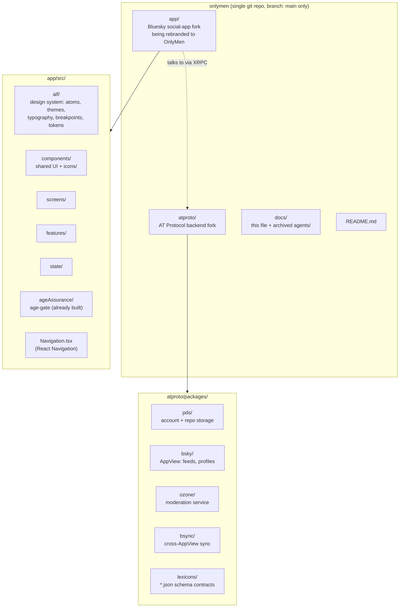

# OnlyMen — Project Handoff

Living reference for anyone (human or AI) picking up work on this repo cold.
Verify anything time-sensitive below against the actual repo state before
acting on it — this is a snapshot, not a live source of truth. Dated history
of completed work lives in `docs/CHANGELOG.md`. When you finish something,
add it to CHANGELOG.md and update only the still-current facts here.

**Brand / domains:**

- GitHub org/user: **18nover**
- Repo: **onlymen** (`github.com/18nover/onlymen`)
- App/OAuth: **onlymen.gay**
- Production PDS: **pds.onlymen.gay**
- Hosted PDS handles: **\*.pds.onlymen.gay**
- Marketing redirect (planned): **onlymen.day** → **onlymen.gay**
- Operator/personal domain: **18nover.gay**

The full domain rationale and PDS runbook are in `docs/pds/PDS.md`. Do not
change the PDS hostname after creating accounts without treating it as an
identity migration.

---

## Recap of Most Recent Session (2026-08-03, Pi backend + PDS build fix)

- **Strategic pivot: WSL abandoned as the dev environment.** WSL kept
  crashing; new split is Windows (`C:\onlymen`) for all app development —
  UI, rebranding, `pnpm web`, Android via `adb` — and the Raspberry Pi
  (`lockard-tech`) as the backend host for ATProto services. `bin/om`'s
  WSL-oriented tmux orchestration (added last session) still works but is
  no longer the primary path; a `backend` start profile was added to it
  regardless (`om start backend` / `make start PROFILE=backend`) for
  anyone still using WSL.
- **Docker Desktop ↔ Pi connectivity established**: Tailscale (MagicDNS
  suffix `tail43a815.ts.net`) + mutual TLS on port 2376 + `ufw` restricting
  2376/22 to LAN (`192.168.1.0/24`) and Tailscale (`100.64.0.0/10`) only —
  never exposed to the public internet. Docker Desktop's context dropdown
  now shows the Pi's containers directly. See the corrected "Raspberry Pi"
  section below (old IP and SSH key path were both stale).
- **PDS/AppView production deploy infrastructure (already built, just
  uncommitted) was found and pushed**: `docker-compose.yml`, `deploy/pds/`,
  `deploy/appview/`, `docs/PDS.md`, `docs/APPVIEW.md`, the `tls-check`
  endpoint, the `bsky-indexer` service, and both production GitHub Actions
  workflows had existed only on the WSL machine's working tree, never
  committed. All committed and pushed in one batch (61 files) since the Pi
  needs it and the CI workflows need it on GitHub to function at all.
- **Found and fixed a real build-reliability bug**: the pinned `tsgo`
  nightly (`@typescript/native-preview` `7.0.0-dev.20260614.1`, resolved
  from a floating `^7.0.0-beta` range) has a concurrency bug — under
  parallel `pnpm run --recursive` builds it intermittently writes a
  "succeeded" `.tsbuildinfo` for a package without finishing emission of
  all its declaration files, breaking dependents with spurious "Cannot
  find module" errors. Broke the PDS Docker build both locally and in the
  new CI workflow. Reproduced deterministically (isolated single-package
  builds always succeeded; concurrent ones failed unpredictably on
  whichever package's emit lost the race). Fixed by bumping to
  `7.0.0-dev.20260707.2` and pinning it exactly instead of floating.
- **Stood up a dev-only PDS on the Pi** at `/home/admin/onlymen` —
  hostname `lockard-tech.tail43a815.ts.net`, invites/rate-limits off,
  throwaway secrets generated on-device. Explicitly not production —
  `pds.onlymen.gay` still needs DNS, an already-running Caddy on the host,
  GHCR login, and the CI deploy secrets from `deploy/pds/README.md` before
  it can go live for real, and the PLC rotation key is still a placeholder
  in the *production* env template specifically.
- **Fixed a recurring `gh`/git push auth break**: `.bashrc` hardcoded an
  expired GitHub PAT four times (`GITHUB_TOKEN`, `GH_TOKEN`, `GITHUB_PAT`,
  `GH_PAT`), which shadowed `gh`'s real stored login on every new shell.
  Removed; see the updated "GitHub push authentication" section below.
- **Adopted a global rules file** at `~/.claude/CLAUDE.md` (branch naming,
  commit style, per-agent commit signatures, PR format, naming
  conventions, code style, dependency pinning, credential handling,
  dev/prod separation, session-handoff discipline) — applies across all of
  the user's repos, not just this one. **Branch strategy changed**: this
  repo flips from direct-to-`main` to feature-branch → PR → merge,
  effective after this session's pushes (everything up to and including
  this recap still went straight to `main`, matching how the rest of the
  session was already done — see "Project conventions" below).
- Still open going into next session: wire `@atproto/oauth-client-expo`
  into `app/src/state/session/` (dependency is installed, nothing uses it
  yet), publish `app/web/oauth/client-metadata.json` at the real
  `onlymen.gay`, and do an end-to-end login/post/AppView-indexing/
  moderation test from the Windows app against the Pi's dev PDS.

---

## Recap of Most Recent Session (2026-08-02, AppView + Ozone scaffolding)

- Added a production deploy path for AppView/Ozone/Bsync under
  `deploy/appview/` (mirroring `deploy/pds/`), plus
  `.github/workflows/appview-production.yml` and `docs/APPVIEW.md`.
- Found that upstream `@atproto/bsky` has no production entrypoint for the
  dataplane/firehose-indexing half of the AppView — only its `dev-env` test
  harness exercises it. Deploying just the existing `bsky`/`ozone`/`bsync`
  images would have produced an AppView that boots and passes health checks
  but never indexes anything. Closed the gap with a new OnlyMen-specific
  `atproto/services/bsky-indexer/` entrypoint.
- Fixed the local-dev `docker-compose.yml --profile appview` profile, which
  could not previously boot (missing `BSKY_SERVICE_SIGNING_KEY`,
  self-referencing `BSKY_DATAPLANE_URLS`, and no `ozone` database ever
  created in Postgres).
- See `docs/CHANGELOG.md`'s "AppView + Ozone production scaffolding" entry
  for the full file list.

---

## Recap of Most Recent Session (2026-07-31, root commands and PDS)

- Added a root command surface for app, AT Protocol, PDS, and engineering-org
  work while preserving each subsystem's own package manager and layout.
- Added `docs/PDS.md` and production deployment templates under `deploy/pds/`.
- Assigned `pds.onlymen.gay` to the production PDS and documented the distinct
  roles of `onlymen.gay`, `onlymen.day`, and `18nover.gay`.

---

## Recap of Most Recent Session (2026-07-22, agent rename)

- Renamed all 13 agent character files from code-style names (Atlas, Circuit,
  etc.) to the human-name roster in `AGENTS.md` (Andrew, Devon, etc.) —
  files, folders, cross-references, `ORG_AGENTS`, and generated docs all
  updated and regenerated. See `CHANGELOG.md` for the full file list.

---

## Recap of Most Recent Session (2026-07-19, docs pass)

- **FIREWALL.md**: Created — SSH rate-limit, Docker/UFW bypass warning, IPv6
  rules, spec-based deletes, RDP removed from core services.
- **CHANGELOG.md**: Created with full session history.
- **AGENTS.md**: Created with 13 human names for the engineering org (see
  roster below). Applied to the codebase on 2026-07-22 — see the rename
  entry in `CHANGELOG.md`. `characters/*.json`, `ORG_AGENTS`, knowledge
  folders, docs, and skills all now use the human-name roster.
- **HANDOFF.md**: This section added; domain branding added.
- **Makefile**: Created at project root (`make handoff`, `make changelog`,
  `make log`, `make update`, `make help`).

Also noted: the `claude/bluesky-agents-planning-mpzmvd` branch has been
merged to main via PR #1. It contained the full NottyBoi branding sweep,
agent retraining, and plugin rename. The remote branch should be deleted
to comply with the single-`main` convention.

---

## What this project is

**OnlyMen** — a decentralized social media app for gay men 18+, built on
[AT Protocol](https://atproto.com) (the same open/federated protocol that
powers Bluesky). Launching web + Android first, iOS later. Do not describe
this as a camera/object-detection/livestreaming app — that was a leftover,
unrelated product vision baked into the AI org's characters early on and has
been deliberately removed.

## Repo structure


```mermaid
graph TD
    subgraph repo["onlymen (single git repo, branch: main only)"]
        app["app/<br/>Bluesky social-app fork<br/>being rebranded to OnlyMen"]
        atproto["atproto/<br/>AT Protocol backend fork"]
        docs_["docs/<br/>this file + archived agents/"]
        readme["README.md"]
    end

    subgraph appsrc["app/src/"]
        alf["alf/<br/>design system: atoms, themes,<br/>typography, breakpoints, tokens"]
        components["components/<br/>shared UI + icons/"]
        screens["screens/"]
        features["features/"]
        state["state/"]
        ageAssurance["ageAssurance/<br/>age-gate (already built)"]
        nav["Navigation.tsx<br/>(React Navigation)"]
    end

    subgraph atprotosrc["atproto/packages/"]
        pds["pds/<br/>account + repo storage"]
        bsky["bsky/<br/>AppView: feeds, profiles"]
        ozone["ozone/<br/>moderation service"]
        bsync["bsync/<br/>cross-AppView sync"]
        lexicons["lexicons/<br/>*.json schema contracts"]
    end

    app --> appsrc
    atproto --> atprotosrc

    app -.talks to via XRPC.-> atproto
```

`eliza/` (elizaOS + the 13-agent AI engineering org) was removed 2026-08-04
while other options for running these agents are evaluated; the archived
agent definitions, knowledge base, and shared standards live at
`docs/agents/`. See the CHANGELOG entry for that date.

## Project conventions (as of this handoff)

- **Branch strategy changed 2026-08-03**: was single-`main`-only/push-direct
  (still true for everything pushed through that date); now feature branch
  → PR → merge to `main`, per the user's global `~/.claude/CLAUDE.md`
  rules — short `type/topic` names (`feat/oauth`, `fix/pds-hostname`),
  delete after merge, `dev` branch allowed for multi-feature integration.
  There's still no CI verify gate on this repo, so run `pnpm verify`
  (atproto) yourself before opening a PR. `git tag` still used for
  release/rollback checkpoints (e.g. `v0.1.0-web-launch`).
- **Naming (confirmed by the user)**: prefer one clear word for files/
  directories (`labels.md`, `ozone.md`); when a second word is genuinely
  needed, **one hyphen**, two words max (`lexicon-schema.md`) — don't stack
  three+ words or mix underscores and hyphens in the same name. Same hyphen
  style for release tags (`v0.1.0-web-launch`).
- **Formatting**: 2-space indent, LF line endings, trim trailing whitespace
  (except Markdown, where trailing spaces can be meaningful) — enforced by
  the root `.editorconfig`, consistent with all three sub-projects' own
  Prettier/Biome configs (all already 2-space, no semicolons, single quotes).
- **Colors/brand palette**: deliberately deferred until real UI work starts
  — `app/src/alf/themes.ts` / `tokens.ts` still pull Bluesky's actual blue
  palette, untouched on purpose. The user's stated direction for later:
  something like OnlyFans' light palette, or a Facebook-blue-style palette —
  not decided, just a starting direction to react to when the time comes.
  Don't touch colors without asking first; this has been explicitly
  deferred, not delegated.

## Repo state

- One git repo, root `/home/jerry/onlymen`, remote `origin` =
  `https://github.com/18nover/onlymen.git`, branch `main`.
- `app/` and `atproto/` are plain tracked subdirectories in this one repo —
  not separate nested repos with their own history/remotes (that changed
  early in this repo's history: `eliza cloned into onlymen`, `atproto cloned
  into onlymen`, `bsky cloned as app`). `eliza/` itself was removed
  2026-08-04 — see the "AI engineering organization" note above.
- `node_modules` is absent in both sub-projects in this environment — install
  before running/building anything (`pnpm install` for app/atproto).
- `github.com/18nover/onlygay` is a different, unrelated repo the user
  created themselves — don't confuse it with this one.

## Major completed work

Core task: align the 13-agent "OnlyMen AI Engineering Organization"
(`eliza/packages/org/`) to actually help build the real Bluesky app + AT
Protocol backend, replacing an old, unrelated camera/object-detection/
livestreaming product vision the org was originally (wrongly) built around.

| Agent | `ORG_ROLE` | Knowledge files (bold = added in the Bluesky retraining) |

**Update (2026-07-22): renamed.** All 13 agents now use the human-name
roster (Andrew, Devon, Quinn, Audrey, Morgan, Lexi, Nadia, Desiree, Ethan,
Parker, Penelope, Seth, Karen) documented in `docs/AGENTS.md`, applied
across character files, `ORG_AGENTS`, knowledge paths, docs, and skills.
The table below is kept for historical mapping context (old code-style name
→ current role); read the "Agent (current)" column as **stale** — see
`docs/agents/AGENTS.md` for the current names.

| Agent (current) | `ORG_ROLE` | Knowledge files (bold = added in the Bluesky retraining) |
| --- | --- | --- |
| Atlas | `engineering_director` | `project-management.md`, `onlymen-roadmap.md` (rewritten — real ATProto roadmap), + shared: `engineering-handbook.md`, `communication-protocol.md`, `definition-of-done.md` |
| Circuit | `devops_engineer` | **`services.md`**, `docker-compose.md`, `github-actions.md`, `eas-builds.md`, `monitoring.md`, `backup-restore.md` |
| Compass | `qa_engineer` | `test-plan-template.md`, `edge-case-catalog.md` (+ ATProto edge-case table), `accessibility-testing.md`, `interop.md`, `mock-pds.md`, + shared `testing-standards.md` |
| Echo | `repository_auditor` | **`forks.md`**, `audit-checklist.md`, `dependency-analysis.md`, `technical-debt-patterns.md`, + shared `coding-standards.md`, `security-standards.md` |
| Forge | `backend_architect` | **`pds.md`**, **`appview.md`**, **`xrpc.md`**, **`firehose.md`**, `auth-patterns.md`, `api-design.md` (XRPC-first), `postgresql-guide.md`, `docker-guide.md`, `redis-patterns.md`, + shared `security-standards.md`, `architecture-principles.md` |
| Lexi (was Stream) | `lexicon_specialist` | **`contact-ageassurance.md`**, `lexicon-schema.md` (+ full type inventory), `nsid.md`, `codegen.md`, `validation.md` |
| Nova | `react_native_architect` | **`client.md`**, `react-native-patterns.md`, `expo-sdk-guide.md`, `navigation-patterns.md`, `state-management.md`, + shared `coding-standards.md`, `design-principles.md` |
| Pixel | `design_system_architect` | `alf-design-system.md` (rewritten from real `app/src/alf/` source), **`icons.md`**, `color-system.md`, `typography.md`, `spacing.md`, `responsive-layouts.md`, + shared `design-principles.md` |
| Prism | `accessibility_engineer` | `wcag-mobile-mapping.md`, `screen-reader-testing.md`, `react-native-a11y.md`, + shared `design-principles.md`, `review-process.md` |
| Pulse | `performance_engineer` | `memory-profiling.md`, `battery-optimization.md`, `network-optimization.md` (+ real network profile), `bundle-analysis.md` |
| Scribe | `technical_writer` | `documentation-templates.md`, `api-doc-standards.md` (lexicons-first), `runbook-template.md`, `release-notes-template.md`, + shared `documentation-standards.md` |
| Sentinel | `security_engineer` | **`identity.md`**, **`oauth.md`**, `owasp-mobile.md`, `threat-modeling.md` (+ OnlyMen outing-risk model), `secret-management.md`, `encryption-guide.md`, + shared `security-standards.md` |
| Vision (was computer-vision) | `moderation_specialist` | **`reporting.md`**, `moderation-actions.md`, `labels.md`, `triage.md`, `ozone.md` |

All 13 agents also reference the new shared primer **`shared/atproto.md`**
and carry an identical `## Project` section at the top of their `system`
prompt anchoring them to OnlyMen-on-ATProto (dev-helpers only — no live
Bluesky network access; plugin-bluesky deliberately not wired).

### Bluesky retraining (second major pass)

Knowledge was rebuilt from three sources: (1) the actual forks — every new
doc cites real paths in `atproto/packages/*` and `app/src/*` verified on
disk; (2) official ATProto/Bluesky concepts (lexicon type system, DID/
handle rules, OAuth profile, labels) distilled into the docs; (3) the
existing 66 docs deepened in place. **Key factual correction:**
`app.bsky.contact.*` and `app.bsky.ageassurance.*` are **upstream Bluesky
lexicon families** (fully present in the generated `@atproto/api` client
and the app UI), not OnlyMen customizations — earlier claims that these
were "our custom lexicons" (and an `app.nottyboi.*` namespace note in
`shared/architecture-principles.md`) were wrong and have been fixed.
OnlyMen currently ships **no** custom lexicons. Also killed: Pixel's
invented `@alf/core` API docs (real ALF = npm `@bsky.app/alf` extended by
`app/src/alf/`, imported as `#/alf`), Atlas's stale chat/Twitch/YouTube
roadmap (rewritten to the real web+Android ATProto plan), and fake 768px
breakpoints (real: 500/800/1300 via `useBreakpoints()`).

Also: deleted two off-stack skill files (`skills/computer-vision`,
`skills/stream-integration`), replaced with `skills/moderation-tooling`
(Vision) and `skills/lexicon-design` (Lexi); fixed
`eliza/plugins/plugin-org-coordinator/src/actions/index.ts`'s `ORG_AGENTS`
list (was still listing `'stream'`, now `'lexi'`); regenerated
`eliza/packages/org/docs/agents/*.md` via `bun run docs` (auto-generated —
never hand-edit, re-run the script instead); rewrote the root `README.md` to
describe the real product and the real purpose of the AI org; fixed a
broken knowledge reference (`atlas.json` pointed at `onlymen-roadmap.md`
before the file itself had been renamed to match — renamed the file, not
the reference, since the reference already reflected forward intent).

## Important gotcha for whoever picks this up next

Mid-project, the repo was restructured (separate nested git repos collapsed
into one) from what turned out to be an older snapshot than the most recent
fixes at the time. This silently reverted several already-committed fixes
back to their pre-fix state, even though `git log` showed them as committed
on a since-defunct branch. It took direct content verification (grep/read
actual files, not trusting git log) to catch this.

**Lesson: after any repo restructuring, branch surgery, or unexplained gap,
verify actual file content on disk — don't assume "it was committed once"
means it's still there.** Sanity check:

```bash
cd eliza/packages/org
grep -rliE "camera|object.detection|yolo|tflite|nottyboi.vision.api" characters/ knowledge/ skills/ shared/ docs/ 2>/dev/null
# should return nothing (or only legitimate expo-camera/photo-upload references — verify by reading)
for f in characters/*.json; do node -e "JSON.parse(require('fs').readFileSync('$f','utf8'))" || echo "BROKEN: $f"; done
node -e '
const fs=require("fs"),path=require("path");
for (const f of fs.readdirSync("characters")) {
  if (!f.endsWith(".json")) continue;
  const c = JSON.parse(fs.readFileSync(path.join("characters",f),"utf8"));
  for (const k of c.knowledge||[]) if (!fs.existsSync(path.join("characters",k.path))) console.log("BROKEN REF:",f,k.path);
}'
```

## Known not-yet-done / lower priority

- ~~Agent character files not yet renamed to human names~~ — done
  2026-07-22, see `CHANGELOG.md`.
- **"NottyBoi" → "OnlyMen" branding sweep: DONE for `eliza/packages/org/`**
  (was actually 45 files, not the 34 previously counted — the count had
  gone stale). All characters, knowledge, shared docs, skills, and script
  comments swept; `docs/agents/*.md` regenerated via `bun run docs`. No
  filenames contained the old brand, so no renames were needed.
  `grep -rliE "nottyboi" eliza/packages/org/` now returns only two
  intentional mentions of the old brand as a *cleanup target*
  (`knowledge/echo/forks.md`'s grep instruction and the roadmap's sweep
  item) — nothing is branded with it. Also fixed outside the org package:
  the coordinator plugin was still **named** `@nottyboi/plugin-org-coordinator`
  in `eliza/plugins/plugin-org-coordinator/package.json` (and referenced in
  `eliza/packages/agent/package.json`) while `packages/org` depended on
  `@onlymen/plugin-org-coordinator` — this name mismatch broke `bun install`
  for the whole eliza workspace; renamed to `@onlymen/`.
  Note: `app/` still carries Bluesky branding deliberately (rebrand
  deferred, see conventions).
- `@bsky.app/alf`'s actual token *values* (hex colors, spacing px scale)
  were never directly verified — the package isn't installed anywhere in
  this environment, so only the re-export/extension pattern in
  `app/src/alf/` was confirmed, not the underlying values.
- A Figma MCP design-system-rules command was run once against `app/`.
  Findings: styling is ALF (atoms/theme/breakpoints, not styled-components/
  Tailwind), icons live in `src/components/icons/*.tsx` with a
  `{Name}_Stroke{width}_Corner{radius}_Rounded` naming convention built via
  `createSinglePathSVG`/`createMultiPathSVG` factories in `TEMPLATE.tsx`,
  navigation is React Navigation (not Expo Router), no Storybook exists.
  Redo the analysis fresh if a Figma integration task comes up again rather
  than assuming this is still current.
- **"Expo Go" is not how Android/iOS will ship** — the app uses the Expo
  *framework*, but has custom native modules/config that Expo Go (the
  generic sandbox app) can't run. Real distribution is `eas build` → native
  APK/IPA → Play Store / App Store, same as any native app. Shipping web
  first is still a reasonable sequence (it's genuinely the lowest-effort
  target — `app/`'s web build is a Go binary + static export, Docker-ready)
  — just not because Expo Go makes native "free."
- Things flagged for the user's own follow-up (not yet acted on by anyone):
  App Store/Play Store 18+ UGC policy compliance (moderation, block/report,
  EULA — required for approval, not optional), trademark/name-collision
  check for "OnlyMen", adding gitleaks-style secret scanning repo-wide (the
  only config that existed, `eliza/.gitleaks.toml`, was removed with
  `eliza/` on 2026-08-04 — nothing currently scans `app/` or `atproto/`),
  license reconciliation (both forks are MIT — keep their notices, decide
  OnlyMen's own license for original code), no CI currently runs against
  the unified repo itself.

## Running the agents for real — model backend (retired 2026-08-04)

This section used to document the elizaOS `claude` CLI backend
(`ELIZA_RUN_BACKEND=claude-sdk`), the `run-eliza` skill, and `bin/org` for
booting individual agent characters. `eliza/` has been removed — none of
that runtime exists anymore. The agent character files themselves (which
recorded which knowledge docs each one loaded, verified working at the time)
are archived at `docs/agents/characters/*.json`.

## Raspberry Pi — backend host (ACTIVE as of 2026-08-03)

WSL kept crashing too often to stay the dev environment. Current split:
**Windows (`C:\onlymen`)** does all app development — UI, rebranding,
`pnpm web`, Android via `adb`; **the Pi (`admin@192.168.1.90`, hostname
`lockard-tech`, Tailscale IP `100.100.67.56`, MagicDNS
`lockard-tech.tail43a815.ts.net`)** hosts the ATProto backend, checked out
at `/home/admin/onlymen`. This supersedes the old "historical assessment"
that used to be here — corrected facts, since several were stale/wrong:

- **SSH**: `~/.ssh/config` (on whichever machine is doing the SSH-ing) has
  a `Host lockard-tech` alias (`HostName 192.168.1.90`, `User admin`,
  `IdentityFile ~/.ssh/remote_server`) — passwordless, already working.
  The old note about a Windows-side key path
  (`/mnt/c/Users/jerry/.ssh/ssh_lockard`) and IP `.91` were both wrong.
- **Docker**: v29.7.1, already running (used for both the dev PDS below and
  the Docker-Desktop-over-Tailscale-TLS setup earlier in this doc's
  history). `docker buildx` needed a manual fix once: Debian's own
  `docker-buildx` package (0.13.1) conflicts with Docker's official
  `docker-buildx-plugin` (0.36.0+, needed for `docker compose build`) over
  the same file path — remove the Debian one first if this recurs
  (`sudo apt-get remove docker-buildx && sudo apt-get install
  docker-buildx-plugin`).
- **No node/pnpm/bun/tmux installed** on the Pi, and none are needed — the
  backend runs via this repo's root `docker-compose.yml`
  (`docker compose up -d pds`), not native processes like `bin/om` uses in
  WSL. `xxd` is also missing (minimal image) — use
  `od -An -tx1 | tr -d ' \n'` instead if a script needs binary→hex.
- Hardware unchanged from the original assessment: Pi 4, aarch64, 4 cores,
  ~4GB RAM — fine for Docker-based service hosting (PDS builds/runs, if
  slowly), still not viable for the 70B/34B local-inference agent stack
  (unrelated concern, unchanged).
- Never rsync `node_modules` (x86 binaries, won't run on ARM64) or live
  embedded-Postgres data without stopping the DB first.

## GitHub push authentication (this environment) — updated 2026-08-03

The SSH-agent-socket method below is stale — that's no longer how this
works. Current method: HTTPS remote
(`https://github.com/18nover/onlymen.git`) with `gh auth login`
(device-flow login, account `jerry-lockard`) + `gh auth setup-git` to
register `gh` as git's credential helper. Pushing `.github/workflows/*.yml`
changes needs the `workflow` OAuth scope specifically —
`gh auth refresh -h github.com -s workflow` if a push is rejected with
"refusing to allow an OAuth App to create or update workflow ... without
`workflow` scope".

**Recurring gotcha, now fixed at the source**: `.bashrc` used to hardcode
an expired PAT as `GITHUB_TOKEN`/`GH_TOKEN`/`GITHUB_PAT`/`GH_PAT`, which
shadowed the real `gh` login in every new shell and made both
`gh auth login` and plain `git push` fail with confusing errors ("The value
of the GH_TOKEN environment variable is being used...", or "Invalid
username or token. Password authentication is not supported"). Removed
2026-08-03. If this resurfaces: `unset GH_TOKEN GITHUB_TOKEN GITHUB_PAT
GH_PAT` before retrying, and `grep -n TOKEN ~/.bashrc` to check for a
reintroduced hardcoded value. Note this only clears the *current* shell —
a long-running session that already inherited the bad value into its
environment keeps it until that specific session ends, even after
`.bashrc` is fixed; new shells opened after the fix are unaffected.

Old SSH-agent-socket method (kept for reference, not currently in use):
user generated an SSH key, added it to GitHub, and an SSH agent socket
appeared at `~/.ssh/agent/s.<random>.agent.<random>` — exporting
`SSH_AUTH_SOCK` to that path before `git push` (remote set to the
`git@github.com:...` SSH form) let pushes succeed.
