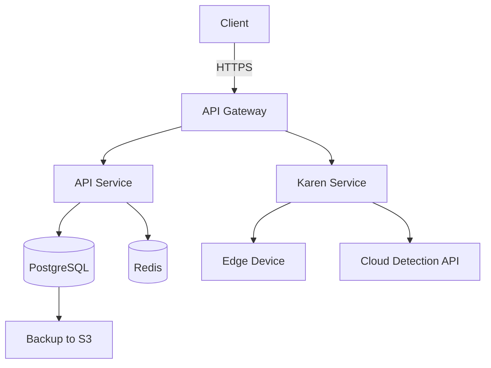

# Technical Writing Skill

This skill covers technical documentation for the OnlyMen project: READMEs, API documentation, architecture guides, deployment docs, runbooks, release notes, post-mortems, audience-appropriate writing, and documentation tooling.

---

## 1. README Templates

### Service README Template

```markdown
# [Service Name]

One-line description of what this service does.

## Quick Start

### Prerequisites
- Node.js 20+
- Docker 24+
- PostgreSQL 16+

### Local Development
```bash
git clone https://github.com/onlymen/[service].git
cp .env.example .env
docker compose up -d
npm install
npm run dev
```

The service is available at http://localhost:3000.

### Running Tests
```bash
npm test
npm run test:e2e
```

## Architecture

Brief description of how this service fits into the system.

```
Client -> API Gateway -> [This Service] -> Database
                         |
                    Redis Cache
```

## Configuration

| Variable       | Required | Default | Description              |
|----------------|----------|---------|--------------------------|
| `DATABASE_URL` | Yes      | --      | PostgreSQL connection    |
| `REDIS_URL`    | Yes      | --      | Redis connection         |
| `PORT`         | No       | 3000    | HTTP listen port         |
| `LOG_LEVEL`    | No       | info    | Logging verbosity        |

## API Reference

See [docs/api.md](./docs/api.md) for full API documentation.

## Deployment

See [docs/deployment.md](./docs/deployment.md) for production deployment.

## Contributing

1. Create a feature branch from `main`
2. Make your changes with tests
3. Open a PR with a clear description
4. Ensure CI passes

## License

Proprietary -- OnlyMen Engineering
```

### README Quality Standards

- The first line must be the service name as an H1
- Second line must be a one-sentence description (no more)
- Quick Start must get a new developer running the service in under 5 minutes
- All required environment variables must be documented
- Architecture section must include a diagram (ASCII or linked image)
- Every README must link to detailed docs, not inline them

---

## 2. API Documentation Standards

### Endpoint Documentation Template

The API surface here is **XRPC**, driven by lexicon schemas (see Lexi's
`lexicon-schema.md`) — Penelope documents the method in narrative form, but
the contract itself is the lexicon JSON, not a hand-written spec:

```markdown
### `com.atproto.repo.createRecord` (procedure)

Create a new record in the authenticated user's repo.

**Authentication**: Session or OAuth access token required.

**Input**:

| Field        | Type     | Required | Description                    |
|--------------|----------|----------|---------------------------------|
| `repo`       | string   | Yes      | DID of the repo (usually the caller's own) |
| `collection` | string   | Yes      | NSID of the record type, e.g. `app.bsky.feed.post` |
| `rkey`       | string   | No       | Explicit record key (auto-generated TID if omitted) |
| `record`     | object   | Yes      | The record itself, matching the collection's lexicon |

**Output**:

```json
{
  "uri": "at://did:plc:abc123/app.bsky.feed.post/3jwdwj2ctlk26",
  "cid": "bafyrei...",
  "commit": { "cid": "bafyrei...", "rev": "3jwdwj2ctlk26" }
}
```

**Errors** (from the lexicon's declared `errors`, not generic HTTP codes):

| Error                  | Description                              |
|-------------------------|--------------------------------------------|
| `InvalidSwapCommit`     | `swapCommit` didn't match current HEAD  |
| `InvalidSwapRecord`     | `swapRecord` didn't match existing value |
```

### API Documentation Rules

- Every method's contract is the lexicon (`atproto/lexicons/**/*.json`), not
  hand-written independently — document behavior and gotchas, don't restate
  the schema (that duplicates what `lex gen-md` already produces).
- All code examples must be copy-pasteable and tested against a real dev-env.
- NSIDs, not URL paths, are the addressing scheme (`com.atproto.repo.createRecord`,
  not `/api/v1/records`) — don't invent REST-style versioned paths.
- Errors documented match the lexicon's declared `errors` array exactly.
- Include a real request/response pair captured from a working call, not a
  fabricated example.

### Generated API Reference

Don't hand-maintain an OpenAPI spec — `atproto/packages/lex-cli`'s `lex
gen-md` generates a Markdown API reference directly from lexicon JSON,
regenerated via `pnpm codegen`. Penelope's job is the narrative doc layer on
top (guides, gotchas, migration notes), not re-deriving the contract by
hand — see `api-doc-standards.md` for the full pipeline.

---

## 3. Architecture Documentation

### Architecture Decision Record (ADR) Template

```markdown
# ADR-[Number]: [Title]

**Date**: [Date]
**Status**: Proposed / Accepted / Deprecated / Superseded by ADR-[X]
**Deciders**: [List of people involved]

## Context

What is the issue that motivates this decision? What forces are at play?

## Decision

What is the change being proposed or decided?

## Consequences

### Positive
- [Benefit 1]
- [Benefit 2]

### Negative
- [Tradeoff 1]
- [Tradeoff 2]

### Risks
- [Risk 1 and mitigation]
```

### System Architecture Document Template

```markdown
# [System Name] Architecture

## Overview
[1-paragraph summary of the system and its purpose]

## System Diagram
[High-level diagram showing all major components]

## Components

### [Component Name]
- **Purpose**: [What it does]
- **Technology**: [Framework, language, runtime]
- **Data Flow**: [What it receives and sends]
- **Scaling**: [How it scales]

## Data Flow

### [Flow Name]
1. [Step 1]
2. [Step 2]
3. [Step 3]

## Data Model
[Entity relationship diagram or schema]

## Security Model
- Authentication: [Method]
- Authorization: [Model]
- Data encryption: [At rest / in transit]

## Deployment Architecture
[How and where components are deployed]

## Operational Requirements
- Uptime: [SLA]
- Latency: [p50, p95, p99 targets]
- Throughput: [Requests per second]
```

### Architecture Documentation Rules

- Every significant architectural decision must have an ADR
- Diagrams must be created as code (Mermaid, PlantUML) for maintainability
- Architecture docs must be reviewed quarterly and updated
- New team members must be able to understand the system from architecture docs alone
- Link ADRs to the relevant code or PRs

---

## 4. Deployment Guides

### Deployment Guide Template

```markdown
# Deployment Guide: [Service Name]

## Prerequisites

- [ ] Access to production server
- [ ] Docker installed
- [ ] Environment variables configured
- [ ] SSL certificates provisioned
- [ ] Database migrations up to date

## Deployment Steps

### 1. Pre-deployment
```bash
# Verify health of current deployment
curl -s https://api.onlymen.dev/health | jq .

# Create database backup
./scripts/backup-db.sh
```

### 2. Deploy
```bash
# Pull latest images
docker compose pull

# Run database migrations
docker compose run --rm api npm run migrate

# Restart services
docker compose up -d --remove-orphans

# Verify deployment
curl -s https://api.onlymen.dev/health | jq .
```

### 3. Post-deployment
- [ ] Health check returns 200
- [ ] No errors in logs for 5 minutes
- [ ] Key user flows tested manually
- [ ] Monitoring dashboards reviewed

## Rollback

```bash
# Revert to previous version
docker compose down
docker compose -f docker-compose.rollback.yml up -d

# Revert database if needed
docker compose run --rm api npm run migrate:undo
```

## Troubleshooting

| Symptom                    | Likely Cause           | Fix                          |
|----------------------------|------------------------|------------------------------|
| 503 errors                 | Service not started    | Check `docker compose logs`  |
| Database connection errors | Pool exhausted         | Restart service              |
| Slow responses             | Cold cache             | Wait 5 minutes or restart    |
```

---

## 5. Runbook Templates

### Runbook Template

```markdown
# Runbook: [Incident Type]

## Overview
- **Service**: [Affected service]
- **Severity**: [Critical / High / Medium]
- **On-call rotation**: [Link]
- **Last updated**: [Date]

## Detection

### Symptoms
- [Symptom 1: what the user sees]
- [Symptom 2: what appears in monitoring]

### Alerts
- [Alert name]: [What it means]

## Diagnosis

### Step 1: Check Service Health
```bash
curl -s https://api.onlymen.dev/health
docker compose ps
docker compose logs --tail=50 api
```

### Step 2: Check Database
```bash
docker compose exec postgres psql -U onlymen -c \
  "SELECT count(*) FROM pg_stat_activity WHERE state = 'active';"
```

### Step 3: Check Dependencies
```bash
docker compose exec api curl -s http://redis:6379/ping
```

## Resolution

### If [Condition A]
```bash
[Command to fix]
```

### If [Condition B]
```bash
[Command to fix]
```

## Escalation

If the above steps do not resolve the issue:
1. Page [Team/Person] on-call
2. Post in #incidents Slack channel
3. [Additional escalation steps]

## Prevention
- [Action item to prevent recurrence]
```

### Runbook Rules

- Every runbook must have a detection, diagnosis, and resolution section
- Commands must be copy-pasteable (no screenshots of terminal output)
- Include expected output for verification commands
- Update runbooks after every incident that uses them
- Test runbooks quarterly with new team members

---

## 6. Release Notes Format

### Release Notes Template

```markdown
# Release [Version] - [Date]

## Highlights
- [Major feature or improvement 1]
- [Major feature or improvement 2]

## What's Changed
### Added
- [New feature] ([@author](link))

### Changed
- [Improvement to existing feature] ([@author](link))

### Fixed
- [Bug fix 1] ([@author](link))
- [Bug fix 2] ([@author](link))

### Removed
- [Deprecated feature removed]

### Security
- [Security patch or improvement]

## Upgrade Notes
- [Breaking change 1: migration required]
- [New environment variable needed]
- [Minimum OS version changed]

## Known Issues
- [Issue 1 with workaround]

## Full Changelog
[Link to commit comparison]
```

### Release Notes Rules

- Write for the user, not for developers
- Every breaking change must be in the Upgrade Notes section
- Link to related issues or PRs for every item
- Highlight the top 2-3 changes at the top
- Use "Added", "Changed", "Fixed", "Removed", "Security" categories (Keep a Changelog format)
- Never omit breaking changes

---

## 7. Incident Post-Mortem Format

### Post-Mortem Template

```markdown
# Incident Post-Mortem: [Title]

**Date**: [Date of incident]
**Duration**: [How long the incident lasted]
**Severity**: [SEV1 / SEV2 / SEV3]
**Author**: [Who wrote this]
**Reviewers**: [Who reviewed]

## Summary

[2-3 sentence summary of what happened, impact, and resolution.]

## Impact

- **Users affected**: [Number or percentage]
- **Duration of impact**: [Time range]
- **Revenue impact**: [If applicable]
- **Data impact**: [Any data loss or corruption]

## Timeline

| Time (UTC)   | Event                                    |
|--------------|------------------------------------------|
| 14:00        | [First symptom observed]                 |
| 14:05        | [Alert fired]                            |
| 14:10        | [On-call engineer acknowledged]          |
| 14:15        | [Root cause identified]                  |
| 14:20        | [Fix deployed]                           |
| 14:30        | [Incident resolved]                      |

## Root Cause

[Detailed technical explanation of what caused the incident.]

## Resolution

[How was it fixed? Include commands, PRs, or rollbacks.]

## What Went Well

- [Thing 1 that worked as expected]
- [Thing 2]

## What Went Wrong

- [Thing 1 that failed or was suboptimal]
- [Thing 2]

## Action Items

| Action                        | Owner   | Due Date  | Status |
|-------------------------------|---------|-----------|--------|
| [Action item 1]               | [Name]  | [Date]    | Open   |
| [Action item 2]               | [Name]  | [Date]    | Open   |

## Lessons Learned

[Key takeaways that should inform future decisions.]
```

### Post-Mortem Rules

- Blameless -- focus on systems and processes, not individuals
- Every SEV1 and SEV2 incident must have a post-mortem within 5 business days
- Post-mortems must be reviewed by at least one person not involved in the incident
- Action items must have owners and due dates
- Track post-mortem action items in the same backlog as engineering work
- Publish post-mortems to the entire engineering team

---

## 8. Writing for Different Audiences

### Audience Adaptation Guide

| Audience           | Style                              | Depth     | Jargon        |
|--------------------|------------------------------------|-----------|---------------|
| New developer      | Tutorial, step-by-step             | Detailed  | Define all    |
| Experienced dev    | Reference, concise                 | Moderate  | Use freely    |
| Product manager    | Outcome-focused, visual            | High-level| Avoid         |
| Operations/SRE     | Runbook, command-oriented          | Detailed  | Use freely    |
| External API user  | Example-driven, precise            | Moderate  | Define terms  |
| Executive          | Summary, impact, numbers only      | Minimal   | Avoid         |

### Writing Principles

1. **Lead with the answer**: Start with what the reader needs to know, then explain why
2. **One idea per paragraph**: Short paragraphs, clear transitions
3. **Use concrete examples**: Abstract descriptions lose readers
4. **Define terms on first use**: Don't assume prior knowledge
5. **Use active voice**: "The service processes the request" not "The request is processed by the service"
6. **Front-load important information**: Don't bury the key point in the third paragraph

### Jargon Glossary (OnlyMen)

| Term          | Definition                                            |
|---------------|-------------------------------------------------------|
| NSID          | Namespaced identifier for a lexicon (`app.bsky.feed.post`) |
| Lexicon       | JSON schema defining a record or XRPC method's contract |
| AT-URI        | `at://did/collection/rkey` — addresses a specific record |
| DID           | Decentralized identifier — an account's permanent identity |
| PDS           | Personal Data Server — hosts a user's repo             |
| Lexi          | The lexicon/schema-design agent                         |
| Karen        | The moderation-tooling agent (Ozone, labels, reports)   |
| Devon       | The infrastructure agent (DevOps, deployment)           |
| Quinn       | The quality agent (testing, QA)                         |
| Penelope        | The documentation agent                                 |

---

## 9. Documentation Tooling

### Recommended Tools

| Purpose               | Tool              | Notes                                |
|-----------------------|-------------------|--------------------------------------|
| API docs              | OpenAPI + Redocly | Auto-generate from spec              |
| Architecture diagrams | Mermaid           | Version-controlled in markdown       |
| Runbooks              | Markdown in repo  | Searchable, reviewable               |
| Release notes         | GitHub Releases   | Linked to changelog                  |
| Knowledge base        | Wiki or docs site | Searchable, categorized              |
| Diagramming           | Excalidraw        | For complex system diagrams          |

### Mermaid Diagram Example

```markdown

```

### Documentation Linting

Use `markdownlint` to enforce consistency:

```json
{
  "default": true,
  "MD013": { "line_length": 120 },
  "MD024": { "siblings_only": true },
  "MD033": false,
  "MD041": false
}
```

---

## 10. Common Gotchas

- **Docs go stale**: If documentation isn't next to the code it describes, it will rot. Co-locate docs with source code.
- **Over-documenting**: Don't document obvious code. Focus on "why" and "gotchas", not "what".
- **Missing context**: A deployment guide that assumes the reader knows which server to SSH into is useless. Be explicit.
- **No examples**: API documentation without request/response examples is incomplete. Every endpoint needs a curl example.
- **Version drift**: Architecture docs and API specs must be version-controlled and updated with code changes.
- **Inconsistent formatting**: Enforce consistent markdown style with linting. Inconsistent docs look unprofessional.
- **Missing diagrams**: Complex systems are hard to understand from text alone. Include diagrams for architecture and data flow.
- **No ownership**: Every doc should have a listed owner. Ownerless docs become stale silently.

---

## 11. Quality Standards

- Every service must have a README that passes the "5-minute test" (new developer can run it in under 5 minutes)
- Every API endpoint must have complete documentation with examples
- Every architectural decision must have an ADR
- Every runbook must be testable by someone unfamiliar with the incident type
- Every release must have written release notes before deployment
- Every SEV1/SEV2 incident must have a post-mortem within 5 business days
- All documentation must pass markdownlint without errors
- Documentation must be reviewed in PRs with the same rigor as code
- Complex systems must have architecture diagrams (Mermaid preferred)
- Documentation must be accessible: proper heading hierarchy, alt text for images, descriptive link text
